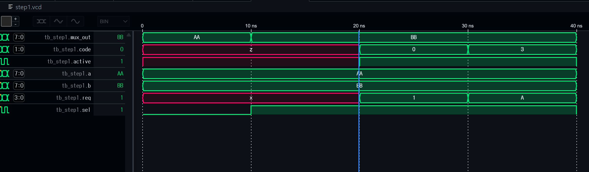
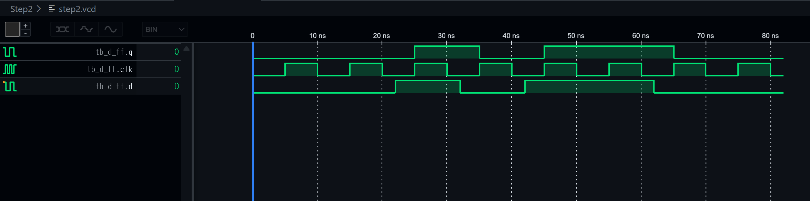
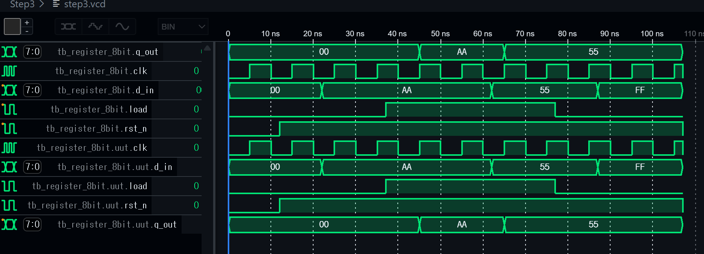
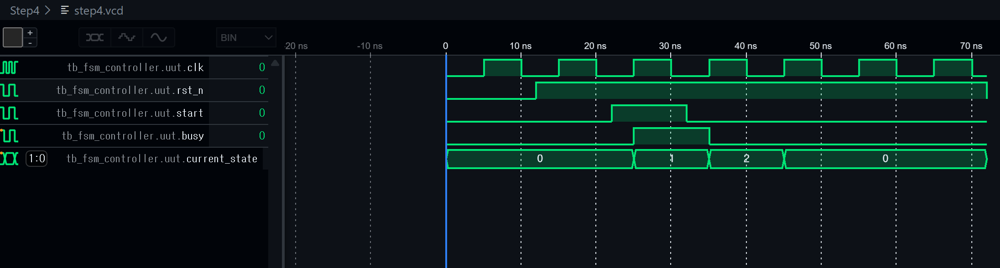
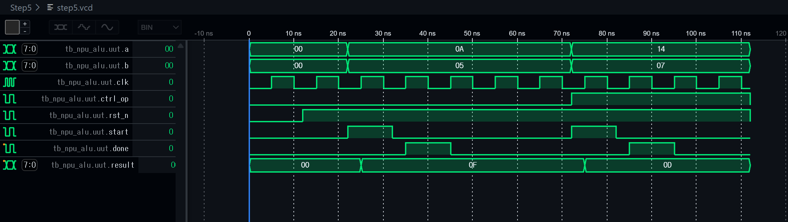
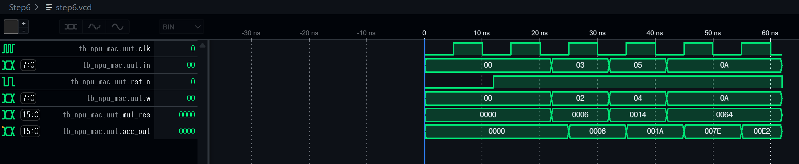
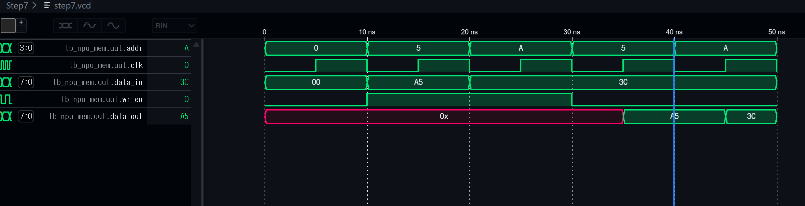

# 🚀 NPU RTL Design: From Compiler to Hardware
모델 경량화(Quantization) 및 컴파일러 스케줄링 지식을 RTL(Register Transfer Level)로 구현하여, 저전력·고효율 AI 가속기 아키텍처를 설계하는 프로젝트입니다.

---

## 🏗️ Project Architecture & Strategy
소프트웨어 계층(Python/PyTorch)의 연산 로직이 실제 실리콘 레벨에서 어떻게 물리적으로 구현되는지 탐구합니다.
- **Goal:** Quantization-Aware Hardware 설계 및 Dataflow 최적화
- **Environment:** Verilog HDL, Icarus Verilog, GTKWave, GitHub Codespaces

---

## 🟢 Step 1: Combinational Logic & Data Routing
NPU 내에서 데이터의 흐름을 제어하고 연산 자원을 할당하기 위한 기초 조합 회로를 설계했습니다.

### 1. 주요 모듈
- **Mux 2-to-1:** 컴파일러의 데이터 경로 제어 로직을 하드웨어로 구현.
- **Priority Encoder (4-to-2):** 여러 연산 유닛의 요청을 하드웨어 레벨에서 우선순위에 따라 즉시 중재.

### 2. 시뮬레이션 결과

- 입력 신호 변화에 따른 출력의 즉각적인 전이(Transition)를 확인하여 조합 회로의 특성을 검증했습니다.

---

## 🔵 Step 2: Sequential Logic & Timing Synchronization
조합 회로에 '시간(Clock)' 개념을 도입하여 데이터를 저장하고 흐름을 제어하는 순차 회로를 설계했습니다.

### 1. 주요 모듈
- **D-FlipFlop (D-FF):** 클럭의 상승 에지(Rising Edge)에서 데이터를 샘플링하여 유지하는 최소 기억 소자.
- **Insight:** 컴파일러가 계산하는 **'1-Cycle Latency'**가 물리적으로 발생하는 지점을 이해하고 동기화 로직을 구축했습니다.

### 2. 시뮬레이션 결과

- 입력 `d`가 변하더라도 `q`는 반드시 `clk` 박자에 맞춰 업데이트되는 동기식 동작을 확인했습니다.

---

## 🟣 Step 3: 8-bit Register & Data Persistence
1-bit D-FF을 확장하여 NPU의 가중치(Weight)나 연산 결과값을 저장할 수 있는 8-bit 레지스터를 설계했습니다.

### 1. 주요 기능 및 모듈
- **8-bit Register with Load Enable:**
  - **Load Signal:** 단순 저장 기능을 넘어, 제어 신호(`load`)가 활성화된 시점에만 데이터를 갱신합니다.
  - **Data Retention:** `load`가 비활성화 상태일 때는 클럭이 유입되어도 기존 데이터를 유지(Hold)합니다.
- **Insight:** 하드웨어가 명령(Instruction)에 따라 특정 시점에만 데이터를 업데이트하는 제어 논리를 이해했습니다.

### 2. 시뮬레이션 결과

- `load=1` 구간에서는 데이터가 클럭 에지에 맞춰 동기화되어 저장되는 것을 확인했습니다.
- `load=0` 구간에서는 입력 데이터가 변경되어도 출력값이 유지되는 **기억 소자(Memory Element)**의 동작을 검증했습니다.

## 🟡 Step 4: FSM(Finite State Machine) Controller 설계
NPU의 하드웨어 자원(ALU, Register, Memory)이 정해진 순서에 따라 유기적으로 움직이도록 제어하는 **'디지털 지휘관'**을 설계했습니다. 

### 1. 설계 목표 및 상태도(State Diagram)
단순한 조합 회로를 넘어, 하드웨어가 현재 어떤 작업 중인지 '상태'를 기억하고 다음 동작을 결정하는 FSM을 구축했습니다.
- **IDLE (00):** 초기 상태. `start` 신호 대기.
- **COMPUTE (01):** 실제 연산이 이루어지는 구간. `busy` 플래그를 `High`로 출력하여 외부 접근 차단.
- **DONE (10):** 연산 완료 및 결과 보고. 이후 자동으로 `IDLE` 복귀.

### 2. 주요 설계 포인트
- **Two-always Block 구조:** 상태 전이(Sequential)와 다음 상태 결정(Combinational) 로직을 분리하여 설계의 가독성과 합성 효율을 높였습니다.
- **Control Signal:** `busy` 출력을 통해 소프트웨어(Compiler)가 하드웨어의 상태를 확인하고 명령을 보낼 타이밍을 결정하는 **Handshaking**의 기초를 구현했습니다.

### 3. 시뮬레이션 및 파형 분석

- **Synchronous Transition:** 모든 상태 변화가 `clk`의 Rising Edge에서 정확히 발생하는 것을 확인했습니다.
- **Trigger Logic:** `start` 신호가 입력된 직후 클럭에서 `IDLE → COMPUTE`로 전이되며 제어 로직이 기동됨을 검증했습니다.
- **Output Validation:** `current_state`가 `01(COMPUTE)`인 구간에서만 `busy` 신호가 활성화되어 제어 신호와 상태가 완벽히 동기화됨을 확인했습니다.

---

## 🔴 Step 5: ALU & Control Logic Integration
FSM 제어 로직과 8-bit 산술 연산기(ALU)를 통합하여 실제 연산이 가능한 모듈을 설계했습니다.

### 1. 주요 기능
- **Instruction-like Control:** `ctrl_op` 신호를 통해 덧셈(Add)과 뺄셈(Sub) 연산을 선택적으로 수행합니다.
- **State-based Computation:** 무작정 연산하지 않고, FSM이 `COMPUTE` 상태일 때만 연산 결과를 업데이트하여 전력 소모를 최적화하고 데이터의 안정성을 확보했습니다.

### 2. 시뮬레이션 분석

- **Calculation Timing:** `start` 신호 인가 후 다음 클럭에서 연산 결과가 `result` 레지스터에 안착하고, `done` 신호가 발생하는 타이밍을 검증했습니다.
- **Operational Accuracy:** 8-bit 정수 연산 범위 내에서 가감산 결과의 정확성을 확인했습니다.

---

## 🔴 Step 6: MAC (Multiply-Accumulate) Unit 설계
NPU 연산의 핵심인 곱셈-누산기(MAC)를 설계했습니다. 

### 1. 설계 개념
- **AI Core Logic:** $Result = \sum (Weight \times Input)$ 공식을 하드웨어로 구현했습니다.
- **Accumulation:** 곱셈 결과를 버리지 않고 레지스터에 계속 더함으로써 행렬 연산의 기초를 마련했습니다.

### 2. 시뮬레이션 분석

- **Cumulative Sum:** 매 클럭마다 입력된 `w`와 `in`의 곱이 `acc_out`에 누적되어 더해지는 과정을 검증했습니다.
- **Bit Width:** 8비트 곱셈의 합산 과정에서 데이터 넘침(Overflow)을 방지하기 위해 16비트 출력폭을 확보했습니다.

## 🔵 Step 7: Memory (SRAM) 설계
NPU 연산에 필요한 대량의 가중치와 데이터를 저장할 수 있는 SRAM 구조를 설계했습니다.

### 1. 설계 특징
- **Memory Array:** 8-bit 데이터 폭을 가진 16개의 저장 공간을 할당했습니다.
- **Synchronous Read/Write:** 모든 메모리 접근을 클럭에 동기화하여 데이터의 안정성을 확보했습니다.
- **Control:** `wr_en` 신호를 통해 읽기(Read)와 쓰기(Write) 동작을 명확히 분리했습니다.

### 2. 시뮬레이션 분석

- 특정 주소(Address)에 데이터를 쓰고, 다시 해당 주소를 호출했을 때 올바른 데이터가 출력되는지 검증했습니다.
- **Latency:** 쓰기 동작 직후 읽기 모드에서 데이터가 출력되기까지 1-Cycle의 지연이 발생하는 하드웨어 특성을 확인했습니다.